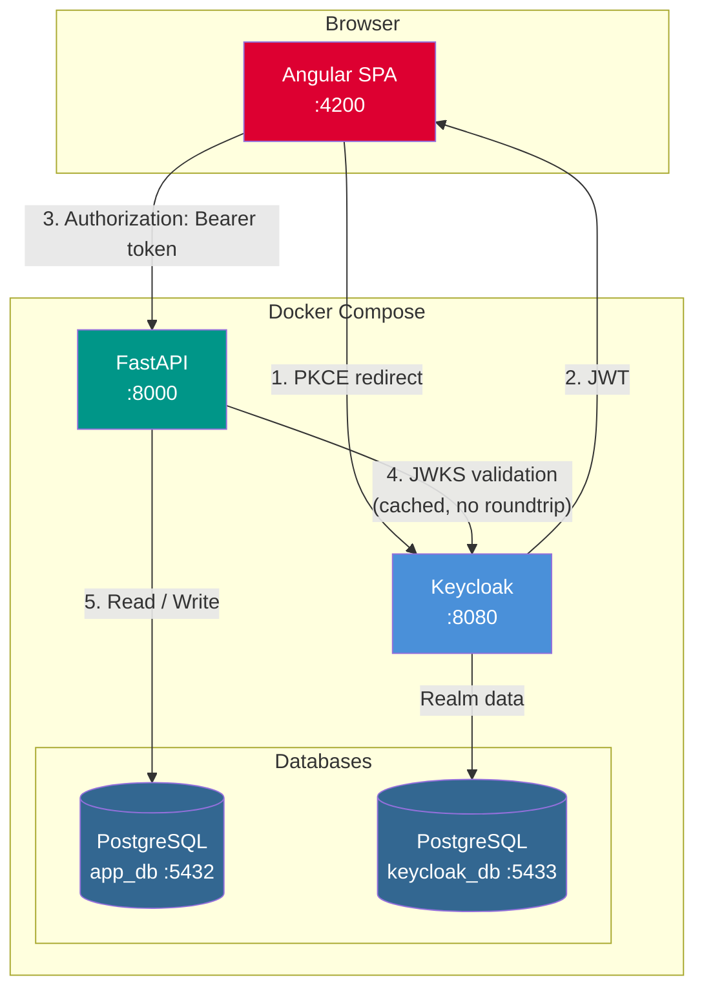
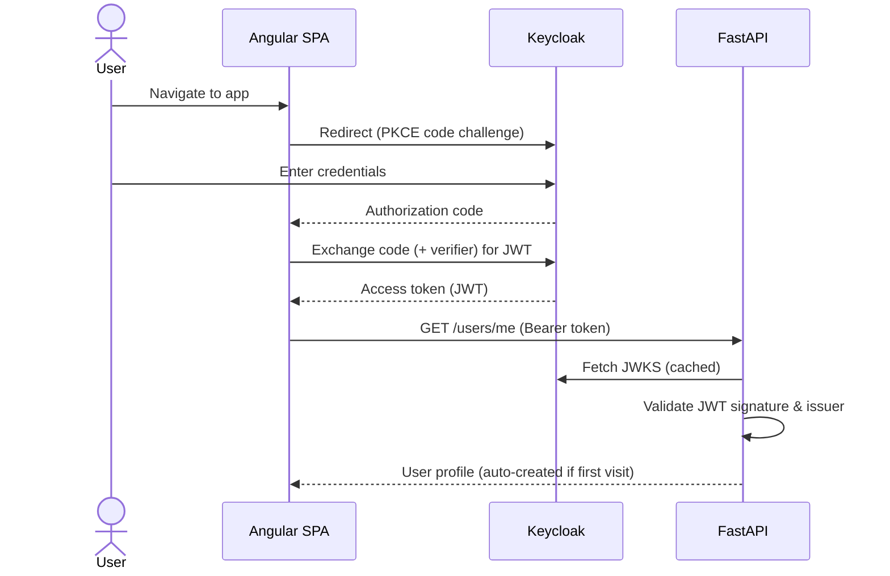
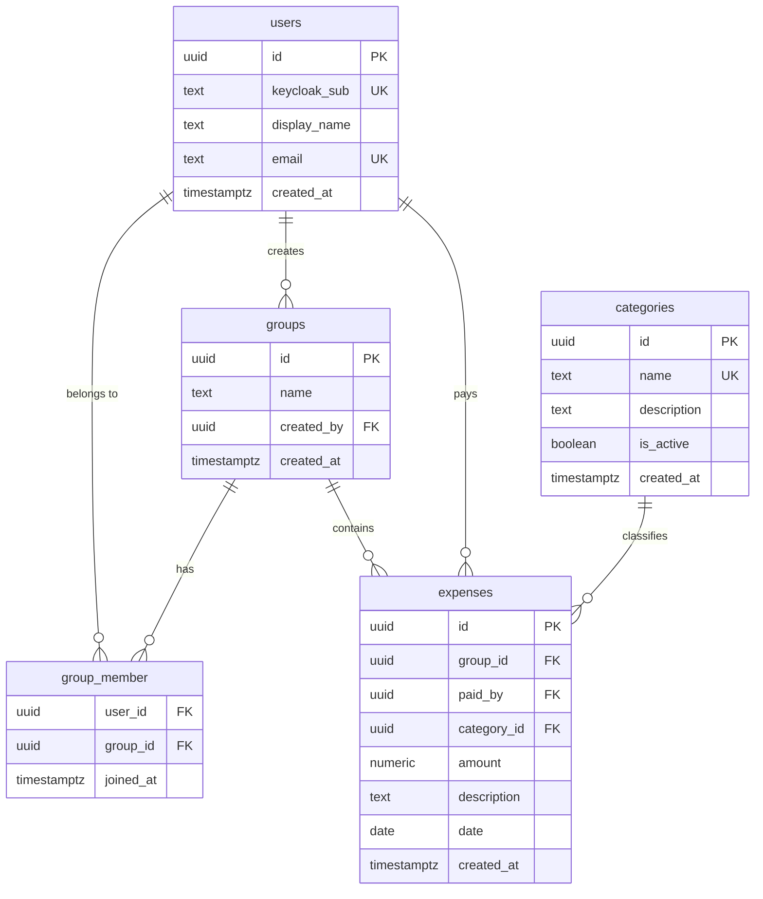

# Expense Manager

A multi-user expense management web application. It allows groups of users to record and track shared expenses, with secure authentication delegated to Keycloak.

The stack is fully containerized via Docker Compose and follows a strict separation of concerns: Angular SPA for the frontend, FastAPI REST API for the backend, Keycloak for identity, and PostgreSQL for persistence.

---

## Table of Contents

- [Features](#features)
- [Architecture](#architecture)
- [Scaffolding](#scaffolding)
- [Environments](#environments)
- [Development](#development)
- [Testing](#testing)
- [Appendix: Command Reference](#appendix-command-reference)

---

## Features

> Most product features are under active development. The list below will be filled in as each feature ships.

### Authentication Flow

Authentication is handled entirely by Keycloak using the **PKCE (Proof Key for Code Exchange)** flow — no custom login forms exist in the application.

```
User → Angular SPA → Keycloak (PKCE login) → JWT issued
JWT → Angular HTTP interceptor → Authorization: Bearer <token> on all API requests
FastAPI → validates JWT signature locally via Keycloak JWKS endpoint (no roundtrip per request)
```

**The app automatically redirects unauthenticated users to Keycloak on load.** There is no manual login button — if a user is not authenticated when the Angular app initializes, it calls `oidc.authorize()` and the browser navigates to Keycloak immediately. After a successful login, Keycloak redirects back to the app and the OIDC library completes the token exchange transparently.

On the first successful authenticated request to `GET /users/me`, the user is automatically created in the application database using the `sub` claim from the JWT. No separate registration step is required.

**Test credentials (dev only):**

| Username | Password   | Email             |
| -------- | ---------- | ----------------- |
| `alice`  | `password` | alice@example.com |
| `bob`    | `password` | bob@example.com   |

### Portal (`/`)

Authenticated landing page. After Keycloak login, displays the current user's profile data fetched from `GET /users/me`. Provides a Logout button.

**Components:**
- `PortalPage` — main page; fetches the authenticated user via `httpResource`
- `UserCardComponent` — displays user data in a Material card; shows a loading spinner and error state

### Group Management (`/groups`, `/groups/:id`)

Allows authenticated users to manage expense groups and their members.

**Pages:**
- `GroupsPage` — lists all groups the user belongs to; create new groups inline; each `GroupCardComponent` supports rename (edit-in-place), delete, and inline add-member
- `GroupDetailPage` — lists all members of a group with their display name and email

**Components:**
- `GroupCardComponent` — card with name, member count, edit/delete/add-member/detail actions
- `AddMemberFormComponent` — select from all app users, filtered to exclude existing members; lazy-fetches the group's current members when opened

**Service:** `GroupsService` — mutation methods (create, rename, delete, add member)

**API endpoints used:**

| Method | Path | Description |
|--------|------|-------------|
| GET | `/api/v1/users` | All registered users (for add-member selector) |
| GET | `/api/v1/groups` | Groups the current user belongs to |
| POST | `/api/v1/groups` | Create group (creator auto-added as member) |
| PATCH | `/api/v1/groups/:id` | Rename group |
| DELETE | `/api/v1/groups/:id` | Delete group (cascades expenses) |
| POST | `/api/v1/groups/:id/members` | Add a user to the group |
| GET | `/api/v1/groups/:id/members` | List all members of the group |

---

## Architecture

The application is composed of five services orchestrated via Docker Compose:

| Service       | Folder      | Technology      | Port | Role                                       |
| ------------- | ----------- | --------------- | ---- | ------------------------------------------ |
| `frontend`    | `/frontend` | Angular v22     | 4200 | SPA — delegates auth to Keycloak via PKCE  |
| `backend`     | `/backend`  | FastAPI 0.136.3 | 8000 | REST API — validates JWT via Keycloak JWKS |
| `keycloak`    | `/keycloak` | Keycloak 26.6.3 | 8080 | Auth server — issues JWT tokens            |
| `app_db`      | `/db`       | PostgreSQL 18.4 | 5432 | Application persistence                    |
| `keycloak_db` | —           | PostgreSQL 18.4 | 5433 | Keycloak persistence (dedicated instance)  |

The `compose.dev.yaml` overlay adds `pgadmin` at port `5050` for database inspection during development.

### System Diagram



### Auth Sequence



### Database Schema



---

## Scaffolding

### Backend (`/backend`)

> _Structure to be documented as features are implemented._

### Frontend (`/frontend`)

```
frontend/src/app/
├── core/           # App-wide infrastructure (ConfigService, auth plumbing)
├── shared/         # Reusable components, pipes, directives (empty — filled as cross-feature needs emerge)
└── features/
    └── <feature>/
        ├── components/          # Standalone UI components (each in own subfolder)
        ├── pages/               # Page components (compose feature components)
        └── <feature>.routes.ts  # Lazy-loaded route config
```

Single-file artifacts (one service, one model, one pipe) live at the feature root — no subfolder until a second file of the same type is added.

---

## Environments

The project supports four environments. Three run all services in Docker containers; one is a hybrid mode where only infrastructure runs in Docker while the application code runs locally for a faster development loop.

### Overview

| Environment          | Who runs it     | Infra  | App (backend + frontend) | Env file     |
| -------------------- | --------------- | ------ | ------------------------ | ------------ |
| **Local — Hybrid**   | Developer       | Docker | Local process            | *(none)*     |
| **Local — Full**     | Developer       | Docker | Docker                   | *(none)* |
| **Development (VM)** | Shared dev VM   | Docker | Docker                   | `.env.dev`   |
| **Production**       | Production host | Docker | Docker                   | `.env.prod`  |

> **Keycloak hostname note:** `KC_HOSTNAME` controls the public hostname Keycloak uses to build the JWT `iss` claim (`http(s)://<KC_HOSTNAME>/realms/expense-app`). It must match exactly the hostname the **browser** uses to reach Keycloak, or authentication will fail.

---

### 1. Local — Hybrid

Infrastructure (databases + Keycloak) runs in Docker. Backend and frontend run as local processes. No `.env` file is needed; `compose.yaml` falls back to its built-in defaults.

**Best for:** active feature development with hot-reload on both frontend and backend.

**Prerequisites:** Docker, uv, Node.js `>=22.22.3`

```bash
# 1. Start only infrastructure
docker compose --profile infra up

# 2a. Backend (separate terminal)
cd backend
uv sync
uv run fastapi dev

# 2b. Frontend (separate terminal)
cd frontend
npm install
ng serve
```

| Service  | URL                   |
| -------- | --------------------- |
| Frontend | http://localhost:4200 |
| Backend  | http://localhost:8000 |
| Keycloak | http://localhost:8080 |

The backend `config.py` defaults point to `localhost:5432` (app_db) and `http://localhost:8080` (Keycloak), matching the ports exposed by the infrastructure containers.

---

### 2. Local — Full Containers

All five services run in Docker. No env file needed — compose.yaml defaults cover local use.

**Best for:** verifying that the full containerized stack works before pushing.

**Prerequisites:** Docker

```bash
docker compose --profile all up --build
```

| Service  | URL                   |
| -------- | --------------------- |
| Frontend | http://localhost:4200 |
| Backend  | http://localhost:8000 |
| Keycloak | http://localhost:8080 |


To also start pgadmin at `:5050`:

```bash
docker compose --profile all --env-file .env.local -f compose.yaml -f compose.dev.yaml up --build
```

---

### 3. Development (VM)

All services run in Docker on a shared development VM. Uses `.env.dev`.

**Best for:** integration testing, QA, or shared dev access from multiple machines.

**Prerequisites:** Docker on the VM; SSH or direct access to copy and edit `.env.dev`

```bash
# On the VM — set <VM_HOSTNAME> to the VM's IP or DNS name before running
cp .env.example .env.dev
# Edit .env.dev: replace every <VM_HOSTNAME> placeholder

docker compose --profile all --env-file .env.dev up --build -d
```

| Service  | URL                         |
| -------- | --------------------------- |
| Frontend | http://\<VM_HOSTNAME\>:4200 |
| Backend  | http://\<VM_HOSTNAME\>:8000 |
| Keycloak | http://\<VM_HOSTNAME\>:8080 |

**Key variables to set in `.env.dev`:**

| Variable               | What to set                             |
| ---------------------- | --------------------------------------- |
| `KC_HOSTNAME`          | VM IP or hostname (e.g. `192.168.1.50`) |
| `BACKEND_CORS_ORIGINS` | `["http://<VM_HOSTNAME>:4200"]`         |
| All `*_PASSWORD` vars  | Any value stronger than the defaults    |

---

### 4. Production

All services run in Docker on the production host. Uses `.env.prod`.

**Best for:** end-user deployments.

**Prerequisites:** Docker on the host; a domain with DNS pointing to the host

```bash
# On the production host
cp .env.example .env.prod
# Edit .env.prod: set the real domain and strong passwords

docker compose --profile all --env-file .env.prod up --build -d
```

| Service  | URL                                         |
| -------- | ------------------------------------------- |
| Frontend | https://expense.yourdomain.com              |
| Backend  | https://expense.yourdomain.com/api *(TBD)*  |
| Keycloak | https://expense.yourdomain.com/auth *(TBD)* |

**Key variables to set in `.env.prod`:**

| Variable                      | What to set                                       |
| ----------------------------- | ------------------------------------------------- |
| `KC_HOSTNAME`                 | Production domain (e.g. `expense.yourdomain.com`) |
| `BACKEND_CORS_ORIGINS`        | `["https://expense.yourdomain.com"]`              |
| `POSTGRES_PASSWORD`           | Strong random password                            |
| `KEYCLOAK_POSTGRES_PASSWORD`  | Strong random password                            |
| `KC_BOOTSTRAP_ADMIN_PASSWORD` | Strong random password                            |

> `.env.prod` must **never** be committed to version control. It is listed in `.gitignore`.

---

### Runtime Configuration (frontend `config.json`)

The frontend reads environment-specific values at **runtime**, not at build time. This lets a single built image be reconfigured per environment without rebuilding — the same pattern Kubernetes uses when it mounts a ConfigMap over a file in a running container.

**How it works:** At startup, before the Angular app bootstraps, `ConfigService` (`frontend/src/app/core/config.service.ts`) does `fetch('/config.json')` and exposes the values as signals (e.g. `apiUrl()`). Every environment provides that `config.json` differently:

**Quick mental model (for `entrypoint.sh`):**

1. `envsubst` reads environment variables from the running container.
2. It reads `config.template.json` and replaces the allowed placeholders (e.g. `${API_URL}`, `${API_VERSION}`, `${KEYCLOAK_AUTHORITY}`).
3. It writes the rendered output to `config.json` (overwriting it if it already exists).

In short: **template + environment variables -> final `config.json` served by Nginx**.

| Environment                          | How `config.json` is provided                                                                                                             |
| ------------------------------------ | ----------------------------------------------------------------------------------------------------------------------------------------- |
| **Local — Hybrid** (`ng serve`)      | The committed `frontend/public/config.json` is served as-is (defaults to `http://localhost:8000/api/v1`).                                 |
| **Local-Full / Dev / Prod** (Docker) | The container `entrypoint.sh` runs `envsubst` over `config.template.json`, producing `config.json` at startup from environment variables. |
| **Kubernetes** (target deployment)   | A ConfigMap is mounted over `config.json` — no `envsubst` needed. *(Conceptual: no manifests live in this repo yet.)*                     |

**The two files in `frontend/public/`:**

- **`config.json`** — committed with the local-dev default (`http://localhost:8000/api/v1`). Used directly by `ng serve`. In Docker it is **overwritten** at container start by the step below, so the committed value only matters for local hybrid development.
- **`config.template.json`** — the template with placeholders like `${VAR_NAME}`. `frontend/entrypoint.sh` substitutes env vars into it via `envsubst` and writes the result to `config.json` before launching Nginx (`frontend/Dockerfile` sets it as the `ENTRYPOINT`).

**Setting it in Docker:** `compose.yaml` passes runtime vars to the frontend service (for example `API_URL: ${API_URL:-http://localhost:8000}` and `API_VERSION: ${API_VERSION:-v1}`). Override values per environment in the corresponding env file (`.env.dev`, `.env.prod`) — e.g. `API_URL=https://expense.yourdomain.com`.

> **Adding a new runtime variable:** if `envsubst` is explicitly whitelisted in `frontend/entrypoint.sh`, adding a new runtime key requires updating both `frontend/public/config.template.json` and the whitelist in `frontend/entrypoint.sh`.
>
> If you want a **single source of change** (template only), use one of these approaches:
> - remove the whitelist and run `envsubst` without an explicit variable list, or
> - keep controlled substitution but build the variable list dynamically from placeholders found in `config.template.json`.
>
> In all cases, after adding the new key in `config.template.json`, the app still needs to consume it in `ConfigService`, and the variable must be declared in `compose.yaml` and `.env.example`.

**Example: dynamic whitelist from template placeholders**

```sh
#!/bin/sh
set -eu

TEMPLATE=/usr/share/nginx/html/config.template.json
OUTPUT=/usr/share/nginx/html/config.json

# Build a whitelist like: ${API_URL} ${AUTH_AUTHORITY} ${AUTH_CLIENT_ID}
VARS="$(grep -o '\${[A-Za-z_][A-Za-z0-9_]*}' "$TEMPLATE" | sort -u | tr '\n' ' ')"

envsubst "$VARS" < "$TEMPLATE" > "$OUTPUT"
exec "$@"
```

---

## Development

### Database Migrations (Alembic)

```bash
# Apply all pending migrations
docker compose exec backend alembic upgrade head

# Generate migration from model changes
docker compose exec backend alembic revision --autogenerate -m "description"

# Apply seed data
docker compose exec -T app_db psql -U expense_user -d expense_db < db/seeds/01-seed.sql
```

### Pre-commit Hooks

The project uses a single Husky hook at `frontend/.husky/pre-commit` that runs on every commit regardless of which files changed:

1. **Backend:** `uv run pre-commit` → `ruff` lint + format
2. **Frontend:** `npx lint-staged` → prettier + eslint

---

## Testing

### Backend

```bash
cd backend
uv run pytest                          # all tests
uv run pytest tests/test_health.py -v  # single file, verbose
```

### Frontend

```bash
cd frontend
ng test          # runs Vitest (not Karma)
```

> Angular 22 uses **Vitest** for unit testing. Do not pass `--browsers ChromeHeadless`.

---

## Appendix: Command Reference

Frequently used commands that are easy to forget.

### Docker

```bash
# Start all services (rebuild images)
docker compose --profile all up --build

# Start in background
docker compose --profile all up -d

# Start only infrastructure
docker compose --profile infra up

# Start with a specific env file (dev/prod environments)
docker compose --profile all --env-file .env.dev up --build

# Stop all services and remove containers
docker compose down

# Stop and also remove volumes (wipes all DB data)
docker compose down -v

# Rebuild a single service without restarting others
docker compose build backend

# Tail logs for a specific service
docker compose logs -f backend

# Open a shell inside a running container
docker compose exec backend bash
docker compose exec app_db bash
```

### Backend

```bash
# Install / sync all dependencies
uv sync

# Add a new production dependency
uv add <package>

# Add a dev-only dependency
uv add --dev <package>

# Run ruff linter
uv run ruff check .

# Run ruff formatter
uv run ruff format .

# Run pre-commit hooks manually
uv run pre-commit run --all-files
```

### Frontend

```bash
# Install dependencies
npm install

# Run linter
ng lint

# Format with Prettier
npm run format

# Generate a new component
ng generate component features/<name>/<name>

# Generate a new service
ng generate service core/services/<name>
```

### Database

```bash
# Connect to app_db via psql
docker compose exec app_db psql -U expense_user -d expense_db

# Apply all pending Alembic migrations
docker compose exec backend alembic upgrade head

# Rollback last migration
docker compose exec backend alembic downgrade -1

# Show current migration state
docker compose exec backend alembic current

# Show migration history
docker compose exec backend alembic history

# Apply seed data
docker compose exec -T app_db psql -U expense_user -d expense_db < db/seeds/01-seed.sql
```

### Keycloak

```bash
# Export current realm config (useful after making changes via the Keycloak UI)
docker compose exec keycloak \
  /opt/keycloak/bin/kc.sh export \
  --dir /opt/keycloak/data/import \
  --realm expense-app
```

### Git

```bash
# Check which branch you are on (should always be mia-iisaia)
git branch

# Stage specific files (avoid staging unrelated changes)
git add backend/app/routers/expenses.py

# Conventional commit
git commit -m "feat: add expense list endpoint"

# Amend last commit message (before pushing)
git commit --amend --no-edit
```
