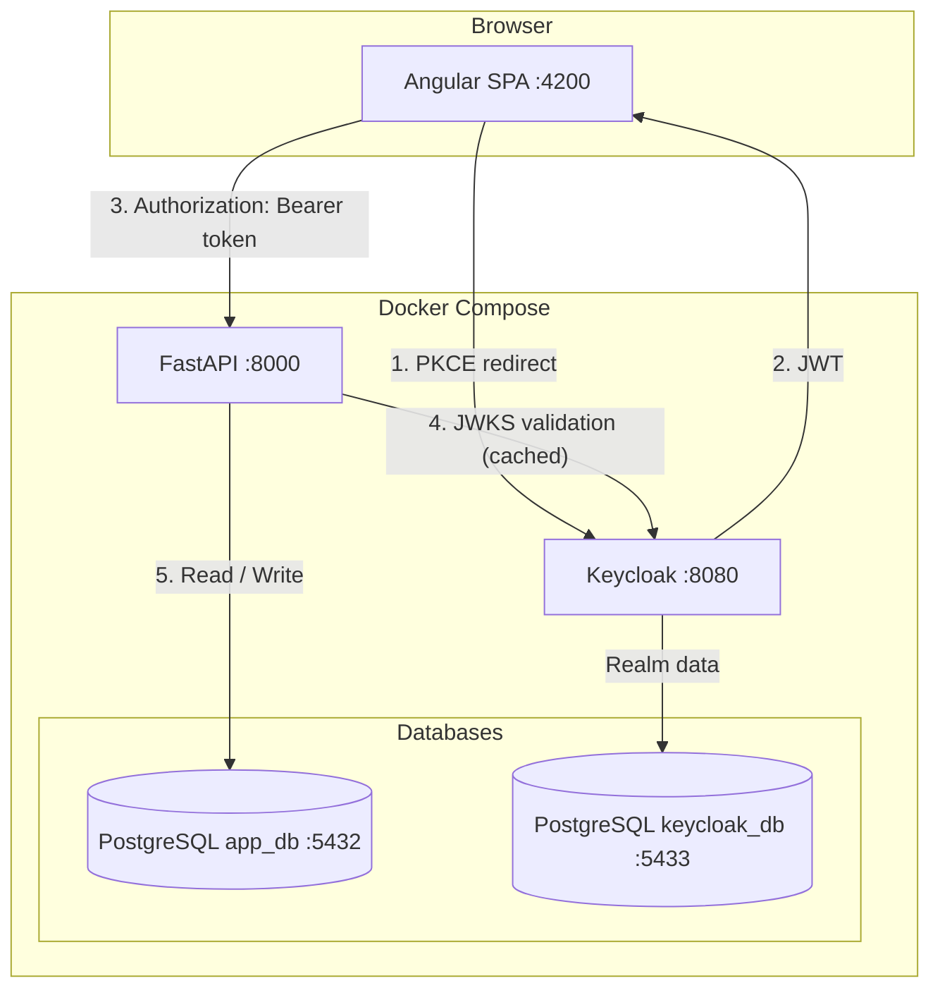
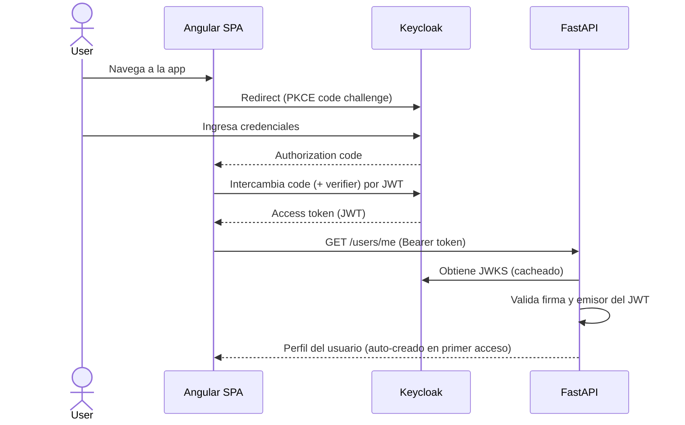
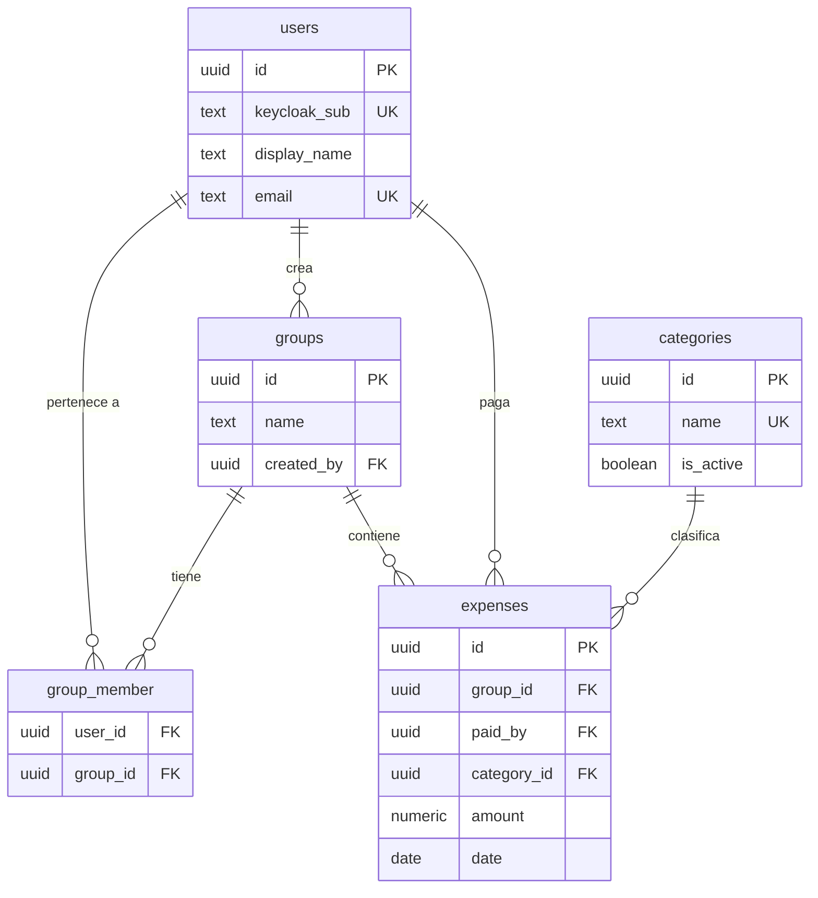

# Guía para generar la presentación — *Expense Manager*

> **Documento de instrucciones para una IA generadora de presentaciones** (Gamma, Beautiful.ai o similar).
> Pegá o entregá este archivo completo. La IA debe producir una presentación a partir del contenido descrito aquí.

---

## 1. Instrucciones para la IA

**Rol:** Sos un diseñador de presentaciones técnicas. Generá una presentación a partir del contenido provisto en la sección "Diapositivas".

**Requisitos obligatorios:**

- **Idioma:** español (Argentina). Registro **formal / académico** — la audiencia son profesores y pares de la *Maestría en Inteligencia Artificial (UBA)*.
- **Cantidad:** **12 diapositivas** exactas (incluyendo Título, Índice y Conclusiones).
- **Densidad de texto:** baja. Cada diapositiva usa los *bullets* provistos casi textualmente; no inventes contenido nuevo ni agregues datos que no estén en esta guía.
- **Notas del orador:** trasladá el bloque "Notas del orador" de cada diapositiva al campo de notas/presenter notes de la herramienta. No las muestres en la diapositiva visible.
- **Placeholders:** respetá los marcadores `[CAPTURA: …]` y `[ESQUEMA: …]` como **espacios reservados**. Dejá un recuadro/zona vacía con ese rótulo para que el autor inserte luego la captura de pantalla o el diagrama. **No** generes imágenes inventadas en su lugar.
- **Diagramas:** donde haya un bloque de código *Mermaid*, la IA puede renderizarlo como diagrama si la herramienta lo soporta; si no, dejar el `[ESQUEMA: …]` como placeholder.
- **Tema central:** el hilo conductor de toda la presentación es que **este proyecto fue construido con Claude Code** (desarrollo asistido por IA). No es solo una app de gastos: es una demostración de metodología de desarrollo asistido.

---

## 2. Guía de estilo

- **Tono visual:** sobrio, técnico, limpio. Mucho espacio en blanco.
- **Tipografía:** sans-serif legible (Inter, Roboto o similar). Títulos en peso semibold.
- **Paleta sugerida** (colores representativos del stack):
  - Angular: `#DD0031` (rojo)
  - FastAPI: `#009688` (teal)
  - Keycloak: `#4A90D9` (azul)
  - PostgreSQL: `#336791` (azul oscuro)
  - Acento neutro / fondo: grises y blanco.
- **Iconografía:** íconos de tecnología (Docker, Angular, Python/FastAPI, PostgreSQL, Keycloak) donde aporten claridad.
- **Consistencia:** mismo pie de página discreto en todas las diapositivas (p. ej. "Expense Manager · Maestría en IA — UBA").

---

## 3. Diapositivas

---

### Diapositiva 1 — Título

**Título:** Expense Manager
**Subtítulo:** Un proyecto full-stack construido con Claude Code

**Datos:**
- Maestría en Inteligencia Artificial — Universidad de Buenos Aires (UBA)
- Materia: Ingeniería de Software Asistida por IA
- Autor: Bruno Masoller
- Fecha: junio de 2026

`[CAPTURA: opcional — captura de la aplicación o logo del proyecto como fondo/portada]`

**Notas del orador:** Presento un gestor de gastos compartidos multiusuario. Lo distintivo no es solo la aplicación, sino que fue íntegramente diseñada y construida mediante desarrollo asistido por IA con Claude Code. A lo largo de la charla voy a mostrar tanto el producto como la metodología de trabajo.

---

### Diapositiva 2 — Índice

**Título:** Índice

**Bullets:**
1. Objetivo y alcance
2. Funcionalidades de la aplicación
3. Arquitectura del sistema
4. Tecnologías utilizadas
5. Modelo de datos
6. Scaffolding y convenciones de código
7. Desarrollo asistido con Claude Code
8. Configuración del proyecto: la carpeta `.claude`
9. Conclusiones

**Notas del orador:** Recorrido: primero el qué (objetivo, funcionalidades), luego el cómo técnico (arquitectura, tecnologías, datos, scaffolding) y finalmente el cómo metodológico (Claude Code y la configuración del proyecto).

---

### Diapositiva 3 — Objetivo y alcance

**Título:** Objetivo y alcance

**Bullets:**
- **Producto:** aplicación web multiusuario para registrar y compartir gastos en grupos.
- **Objetivo académico:** demostrar un flujo completo de desarrollo full-stack **asistido por Claude Code**, con metodología disciplinada (especificación → plan → implementación).
- **Alcance funcional:** autenticación delegada, gestión de grupos y miembros, registro y consulta de gastos por grupo.
- **Fuera de alcance (a la fecha):** liquidación/balances entre miembros, división de gastos, reportes y notificaciones (trabajo futuro).
- **Principio de diseño:** estricta separación de responsabilidades y stack 100% containerizado con Docker Compose.

**Notas del orador:** El alcance es deliberadamente acotado para poder mostrar profundidad metodológica. La app resuelve el ciclo central (autenticación, grupos, gastos) y deja explícito qué queda pendiente. El énfasis está en cómo se construyó tanto como en qué hace.

---

### Diapositiva 4 — Funcionalidades de la aplicación

**Título:** Funcionalidades

**Bullets:**
- **Autenticación (Keycloak + PKCE):** login delegado a Keycloak mediante el flujo PKCE; no existen formularios de login propios. Redirección automática de usuarios no autenticados.
- **Portal (`/`):** página de inicio autenticada; muestra el perfil del usuario actual (`GET /users/me`) y permite cerrar sesión. El usuario se crea automáticamente en la base en su primer acceso.
- **Gestión de grupos (`/groups`, `/groups/:id`):** crear, renombrar y eliminar grupos; listar miembros; agregar miembros desde el padrón de usuarios.
- **Gestión de gastos (`/groups/:id/expenses`):** registrar gastos (descripción, monto, fecha, grupo) y listarlos por grupo, ordenados por fecha. Acceso rápido mediante botón flotante (+).

`[CAPTURA: la aplicación en uso — portal y/o listado de gastos de un grupo]`

**Notas del orador:** Cuatro bloques funcionales. Destacar que no hay registro manual: el usuario se materializa en la base a partir del claim `sub` del JWT en el primer request autenticado. La app siempre opera sobre grupos: un gasto pertenece siempre a un grupo.

---

### Diapositiva 5 — Arquitectura del sistema

**Título:** Arquitectura

**Bullets:**
- **Cinco servicios** orquestados con Docker Compose, con separación estricta de responsabilidades.
- **Frontend (Angular SPA, :4200)** delega autenticación a Keycloak vía PKCE.
- **Backend (FastAPI, :8000)** valida el JWT **localmente** contra el endpoint JWKS de Keycloak (sin roundtrip por request).
- **Keycloak (:8080)** emite los tokens; tiene su propia base dedicada.
- **Persistencia:** `app_db` (PostgreSQL :5432) para la app; `keycloak_db` (PostgreSQL :5433) para Keycloak.

`[ESQUEMA: diagrama de sistema + secuencia de autenticación — usar los dos diagramas Mermaid de abajo]`

**Diagrama de sistema (Mermaid):**


**Secuencia de autenticación (Mermaid):**


**Notas del orador:** La clave del diseño de seguridad: el backend no consulta a Keycloak en cada request. Cachea las claves públicas (JWKS) y valida firma y emisor (`iss`) localmente. El `iss` esperado en dev es `http://localhost:8080/realms/expense-app`. Cada servicio tiene una única responsabilidad.

---

### Diapositiva 6 — Tecnologías utilizadas

**Título:** Stack tecnológico

**Bullets (agrupar por capa):**
- **Frontend:** Angular 22 (standalone components, signals, `httpResource`, zoneless), TypeScript, Vitest.
- **Backend:** FastAPI 0.136.3, Python 3.12+, SQLAlchemy async, Pydantic, pytest.
- **Autenticación:** Keycloak 26.6.3 (OIDC / PKCE, JWT, JWKS).
- **Persistencia:** PostgreSQL 18.4, migraciones con Alembic.
- **Infraestructura:** Docker Compose, Nginx (sirve la SPA), configuración por *runtime* (`config.json` vía `envsubst`).
- **Tooling:** `uv` (gestión de dependencias backend), Ruff (lint/format), Prettier + ESLint, Husky (pre-commit).

`[ESQUEMA: opcional — grilla de logos por capa (Angular, FastAPI, Keycloak, PostgreSQL, Docker)]`

**Notas del orador:** Stack moderno y deliberado. Angular 22 con las APIs más nuevas (signals, httpResource, zoneless). En backend, FastAPI async con SQLAlchemy y `uv` como gestor. Todo parametrizado por variables de entorno y reconfigurable por entorno sin reconstruir la imagen (patrón ConfigMap de Kubernetes).

---

### Diapositiva 7 — Modelo de datos

**Título:** Modelo de datos

**Bullets:**
- **`users`** — usuarios; `keycloak_sub` enlaza con el claim `sub` del JWT.
- **`groups`** — grupos de gasto; cada uno tiene un creador.
- **`group_member`** — relación N:N entre usuarios y grupos.
- **`categories`** — categorías de gasto (asignación automática).
- **`expenses`** — gastos; pertenecen a un grupo, un pagador (`paid_by`) y una categoría.

`[ESQUEMA: diagrama entidad-relación — usar el Mermaid de abajo]`

**Diagrama ER (Mermaid):**


**Notas del orador:** Cinco tablas con nombres en plural por convención. Borrar un grupo cascadea sus gastos. La categoría se asigna automáticamente al crear el gasto. Toda evolución del esquema pasa por migraciones Alembic, nunca editando el SQL de init.

---

### Diapositiva 8 — Scaffolding y convenciones

**Título:** Scaffolding y convenciones de código

**Bullets:**
- **Frontend — organización por *feature*:** cada feature agrupa `components/`, `pages/` y su archivo de rutas *lazy-loaded*. Artefactos de archivo único (un servicio, un modelo) viven en la raíz del feature hasta que aparece un segundo.
- **Backend — organización por capas:** `models/` (ORM), `schemas/` (Pydantic), `routers/` (endpoints), `services/` (lógica de negocio), `deps.py` (dependencias compartidas).
- **Convenciones explícitas y versionadas:** reglas de estilo por área documentadas en `.claude/rules/`.
- **Rutas REST** siempre bajo `/api/v1/`; los routers devuelven schemas, no objetos ORM.

`[ESQUEMA/CAPTURA: árbol de carpetas frontend (features/) y backend (app/) lado a lado]`

**Estructura frontend (referencia):**
```
frontend/src/app/
├── core/        # infraestructura transversal (ConfigService, auth)
├── shared/      # componentes/pipes reutilizables entre features
└── features/
    └── <feature>/
        ├── components/   # cada componente: ts + html + scss + spec
        ├── pages/        # páginas que componen el feature
        └── <feature>.routes.ts
```

**Estructura backend (referencia):**
```
backend/app/
├── main.py      # entrypoint FastAPI, registro de routers, CORS
├── models/      # modelos SQLAlchemy
├── schemas/     # schemas Pydantic (request/response)
├── routers/     # un archivo por recurso
├── services/    # lógica de negocio y acceso a datos
└── deps.py      # dependencias (sesión DB, usuario actual)
```

**Notas del orador:** Las convenciones no son tácitas: están escritas y versionadas, lo que permite que Claude Code genere código consistente con el resto del proyecto. Esto conecta con la siguiente sección: las reglas del scaffolding alimentan directamente a las *skills* de generación.

---

### Diapositiva 9 — Desarrollo asistido con Claude Code

**Título:** Desarrollo asistido con Claude Code

**Bullets:**
- **Metodología disciplinada:** cada feature siguió el ciclo **especificación → plan → implementación**, con los documentos de diseño y los planes versionados en el repositorio.
- **Commits atómicos y convencionales:** ~166 commits del proyecto con mensajes `feat:`, `fix:`, `docs:`, `chore:`, `refactor:`, `test:`.
- **Trazabilidad:** se puede reconstruir la evolución del proyecto leyendo el historial (scaffolding → autenticación → portal → grupos → gastos).
- **Calidad automatizada:** hook `pre-commit` (Husky) que ejecuta Ruff (backend) y lint-staged/Prettier+ESLint (frontend) en cada commit.

`[CAPTURA: salida de "git log --oneline" mostrando la secuencia de commits convencionales]`

**Notas del orador:** El historial es evidencia de la metodología. Cada feature grande aparece primero como "docs: add … design spec", luego "docs: add … implementation plan" y recién después los `feat:` de implementación. Los commits son chicos y descriptivos. La calidad se fuerza con un hook de pre-commit que corre en cada commit.

---

### Diapositiva 10 — La carpeta `.claude` (1/2): configuración y reglas

**Título:** Configurando Claude Code para el proyecto

**Bullets:**
- **`CLAUDE.md`** — instrucciones de proyecto que Claude Code carga siempre: arquitectura, comandos, decisiones de diseño y convenciones de Git. Es la "memoria" del proyecto.
- **`settings.json`** — permisos de herramientas: lista `allow` (comandos `git`, `docker`, `npm`, `uv`, `pytest`, etc.) y lista `deny` (bloquea `rm -rf`, `git push`, `git reset --hard`, `docker volume rm`, …).
- **`rules/` — reglas *scoped* por área:**
  - `frontend-rules.md` (aplica a `frontend/**`): Angular 22, signals, accesibilidad WCAG AA, estructura de features.
  - `backend-rules.md` (aplica a `backend/**`): FastAPI, SQLAlchemy async, Alembic, diseño de API.

`[CAPTURA: árbol de la carpeta .claude/ — settings.json, CLAUDE.md, rules/, skills/]`

**Notas del orador:** Acá está el corazón de "construido con Claude Code". `CLAUDE.md` da contexto permanente. `settings.json` define qué puede ejecutar el agente: las prohibiciones (deny) protegen contra acciones destructivas. Las reglas están delimitadas por path, así Claude aplica las reglas de Angular solo al editar el frontend y las de FastAPI solo en el backend.

---

### Diapositiva 11 — La carpeta `.claude` (2/2): Skills

**Título:** Skills: automatizando tareas repetitivas

**Bullets:**
- **`scaffold-feature`** — genera un feature Angular 22 completo (rutas lazy, servicio, páginas y componentes co-localizados) respetando las convenciones del proyecto.
- **`scaffold-resource`** — genera un recurso REST de backend con todo su andamiaje (modelo, schemas, servicio, router bajo `/api/v1`, registro y tests pytest).
- **`reset-db`** — restaura la base de la app (`app_db`) a estado limpio y re-aplica los seeds; protege Keycloak.
- **`reset-all-db`** — reinicio total: destruye **todos** los volúmenes (app + Keycloak) y reconstruye desde cero.

`[ESQUEMA/CAPTURA: opcional — invocación de una skill (p. ej. scaffold-feature) y el resultado generado]`

**Notas del orador:** Las skills encapsulan procedimientos del proyecto en comandos reutilizables. Las de scaffolding consumen directamente las reglas de la diapositiva anterior, garantizando que el código generado sea idéntico en estructura al existente. Las de reset aceleran el ciclo de desarrollo local. Son destructivas y piden confirmación.

---

### Diapositiva 12 — Conclusiones

**Título:** Conclusiones

**Bullets:**
- Se construyó una **aplicación full-stack funcional y containerizada** con un stack moderno y separación estricta de responsabilidades.
- **Claude Code como acelerador disciplinado:** especificaciones, planes y commits atómicos produjeron un historial trazable y código consistente.
- **La configuración es parte del proyecto:** `CLAUDE.md`, permisos, reglas *scoped* y *skills* convierten las convenciones en algo ejecutable y repetible.
- **Aprendizaje:** invertir en contexto y reglas para el agente mejora la calidad y consistencia del resultado.
- **Próximos pasos:** balances y división de gastos entre miembros, reportes y despliegue en Kubernetes.

`[CAPTURA: opcional — vista final de la app o agradecimiento]`

**Notas del orador:** Cierre: el proyecto demuestra que el desarrollo asistido por IA, con metodología y configuración explícitas, produce resultados de calidad y trazables. La inversión en `CLAUDE.md`, reglas y skills se paga en consistencia. Quedan como trabajo futuro las funcionalidades de liquidación y el despliegue productivo. Gracias.

---

## 4. Checklist final para la IA

- [ ] 12 diapositivas, en español, tono académico.
- [ ] Título, Índice y Conclusiones incluidas.
- [ ] Notas del orador trasladadas al campo de notas (no visibles en la diapositiva).
- [ ] Placeholders `[CAPTURA: …]` / `[ESQUEMA: …]` respetados como zonas reservadas.
- [ ] Diagramas Mermaid renderizados o dejados como placeholder.
- [ ] Densidad de texto baja y estilo visual consistente.
