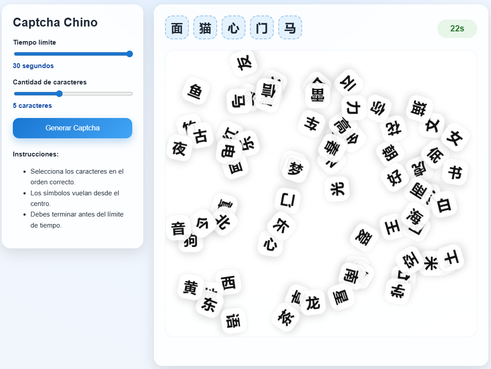

# TP1 - Worst captcha ever!

| Atributo         | Valor                                                    |
| ---------------- | -------------------------------------------------------- |
| Materia          | Introducción a la ingeniería de software asistida por IA |
| Trabajo práctico | TP1 - Worst captcha ever!                                |
| Descripción      | Un captcha frustrante y difícil de usar.                 |

## Worst captcha ever!

Este proyecto es un captcha que muestra caracteres chinos flotando en la pantalla, y el usuario debe seleccionarlos en orden dentro de un tiempo límite. El objetivo es crear un captcha que sea frustrante para el usuario, con una interfaz totalmente incómoda y difícil de usar, pero que aún así cumpla su función de verificar que el usuario es humano.

### Características principales:

- Los caracteres flotan desde un punto central y se mueven por la pantalla.
- El usuario debe seleccionar los caracteres en el orden correcto.
- El tiempo límite para completar el captcha es configurable entre 5 y 30 segundos.
- La cantidad de caracteres a seleccionar es configurable entre 2 y 10.

### Modo de uso:

1. Prepara un mate, café, sal a correr un rato, haz lo que quieras para distraerte un poco antes de intentar resolver el captcha.
2. Abre el archivo `index.html` con un navegador web.
3. Configura el tiempo límite y la cantidad de caracteres a seleccionar.
4. Selecciona "Generar captcha" para iniciar el captcha.
5. Selecciona los caracteres flotantes en el orden correcto antes de que se acabe el tiempo.
6. Disfruta de la frustración.

### Ejemplo:

